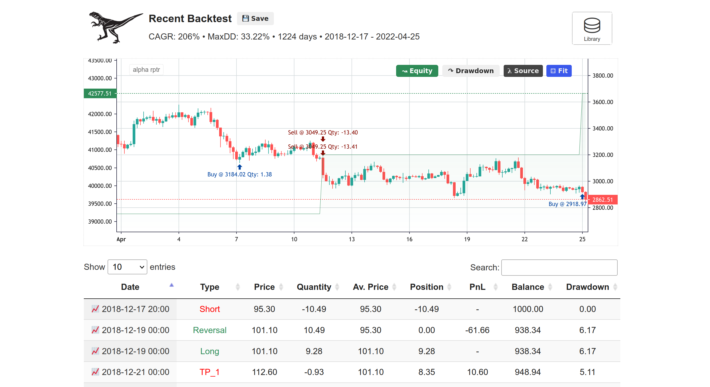
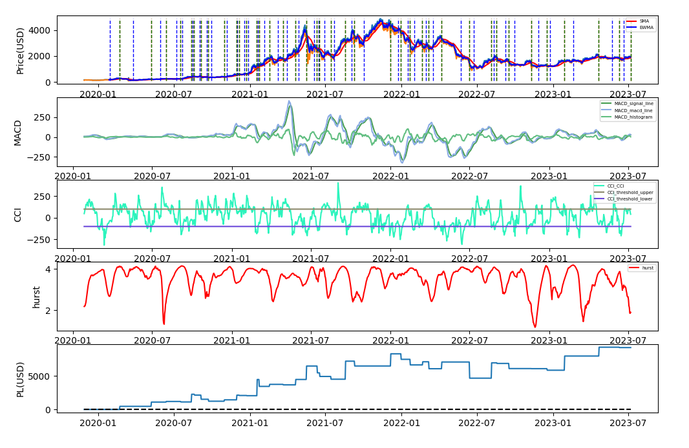

# alpha rptr


## About

The Github repository features a trading system designed for automated algorithmic trading on Binance Futures, Bybit, BitMEX and FTX.

This trading system aims to offer an easy-to-use platform for users to test their trading strategies through backtesting and paper trading, as well as execute trades in live environments. With the goal of minimizing discrepancies between simulated and live trading results, the system allows for seamless transitions from backtesting to paper trading and finally to live trading. Additionally, users can expect minimal changes to their strategy code when transitioning from simulated to live trading.

While developing strategies, users are expected to have a basic understanding of trading and are not subject to many limitations. The system is designed around pre-defined events, such as market data updates, order updates, and trade executions, and provides various technical features, including advanced order types, and real-time position and order monitoring, to support the development and execution of trading strategies.

## Disclaimer

Please note that the author of this software is not liable for any losses, damages or other adverse consequences resulting from the use of this software. It is highly recommended that you exercise caution and thoroughly test your trading strategy using small sizes over an extended period of time to ensure that it performs as expected before deploying it with larger sums of money.

## Table of Contents

- [About](#about)
- [Disclaimer](#disclaimer)
- [Features](#features)
- [Refrence Strategies](#reference-strategies)
- [Installation](#how-to-install)
  * [Install packages](#1-install-packages)    
  * [Setting keys](#2-setting-keys)   
  * [Exchange config](#3-exchange-config)  
 - [How to Run](#how-to-run)
    * [Mode](#mode)
      + [Production Trade Mode](#1-production-trade-mode)
      + [Demo Trade Mode](#2-demo-trade-mode)
      + [Backtest Mode](#3-backtest-mode)
      + [Hyperopt Mode](#4-hyperopt-mode)
      + [Stub Trade Mode (paper trading)](#5-stub-trade-mode-paper-trading)    
- [How To Add a Custom Strategy](#how-to-add-a-custom-strategy)
- [Key Functions](#key-functions)
  * [Orders](#orders)
  * [Position](#position)
  * [Account](#account)
  * [Indicators and Functions](#indicators-and-functions)
      + [Trend Indicators](#trend-indicators)
      + [Volatility Indicators](#volatility-indicators)
      + [Momentum Indicators](#momentum-indicators)
      + [Moving Averages](#moving-averages)
      + [Bands and Channels](#bands-and-channels)    
      + [Pattern Recognition](#pattern-recognition)    
      + [Math Operators](#math-operators)   
      + [Probability Distributions and Simulations](#probability-distribution-and-simulations)   
      + [Regression](#regression)   
      + [Normalization Techniques](#normalization-techniques)   
      + [Miscellaneous and Custom](#miscellaneous-and-custom)   
- [Strategy Session Persistence](#strategy-session-persistence)
- [Advanced Session Usage](#advanced-session-usage)
- [HTML5 Workbench for Backtests](#html5-workbench-for-backtests)
- [Plotting in Matplotlib](#plotting-in-matplotlib)
- [Logging Metrics to InfluxDB](#logging-metrics-to-influxdb)
- [Discord Server](#discord-server)
- [Tip Jar](#tip-jar)

## Features

- REST API and Websocket implementation for multiple cryptocurrency exchanges, including Bybit, BitMEX, Binance Futures, and FTX.
- Pre-defined events for market data updates, order updates, and trade executions.
- All types of orders supported including majority of parameters/combinations - if you miss any, you can request
- Supports sophisticated order types, such as limit orders, stop-loss orders,trailing stop orders, iceberg orders and limit chasing orders.
- Custom strategy implementation, allowing traders to define their own trading algorithms and indicators.
- Backtesting framework to test strategies against historical market data.
- Testnet for Bybit, BitMEX and Binance Futures, allowing traders to test their strategies without risking real funds.
- Paper trading or stub trading for simulating trades with fake funds.
- TA-lib indicators and many others including custom indicators
- Simple strategy implementation, allowing traders to migrate strategies from other platforms such as TradingView.
-  Discord webhooks and Line notifications supported for receiving real-time updates and notifications.

## Reference Strategies

**Please note** that the implemented reference strategies are provided as examples for educational and reference purposes only. They are not intended to be used as a fully functional trading strategy for live trading without further modifications and proper testing. The strategies may not be suitable for all market conditions and may result in losses. We highly recommend that you thoroughly understand the strategy and test it extensively before using it for live trading. Always use caution and do your own research before making any trading decisions.

1. Supertrend strategy
2. Parabolic SAR
3. MACD 
4. CandleTester
5. CandleTesterMult
6. Channel Breakout
7. Cross SMA
8. RCI
9. Open Close Cross Strategy
10. Trading View Strategy (implemented but not currently supported via Gmail integration)

Note: Although TradingView Strategy is not currently supported in this implementation, you can use the following project for TradingView Webhooks trading: https://github.com/CryptoMF/frostybot.

## Requirements

- Python: 3.9.9

## How to install

### 1. Install packages

#### OSX

```bash
$ brew install ta-lib
$ git clone https://github.com/TheFourGreatErrors/alpha-rptr.git
$ cd alpha-rptr/
$ pip install -r requirements.txt
```

#### LINUX

```bash
$ wget http://prdownloads.sourceforge.net/ta-lib/ta-lib-0.4.0-src.tar.gz
$ tar xvzf ta-lib-0.4.0-src.tar.gz
$ cd ta-lib/
$ ./configure --prefix=/usr
$ make
$ sudo make install
$ git clone https://github.com/TheFourGreatErrors/alpha-rptr.git
$ cd alpha-rptr/
$ pip install -r requirements.txt
```
**Note:** We are using a Python wrapper for the `TA-Lib` library, which provides a wide range of technical analysis functions for financial markets. It is important to note that the underlying TA-Lib library is written in C language. Therefore, in order to install and use this library, it needs to be properly compiled on your system. The Python wrapper allows these functions to be used from within Python code, but the installation process may require some technical knowledge. It is important to ensure that the C library is properly compiled prior to installation in order to avoid errors and ensure that the library functions correctly.

### 2. Setting Keys 

The `src/config.py` file is where you can set your API keys and other configuration settings for the trading bot. Here's how to do it:
1. Open the config.py file in a text editor or IDE.
2. Look for the binance_keys section of the configuration dictionary. This is where you'll enter your Binance API keys.
3. Replace the empty string "" in the API_KEY and SECRET_KEY fields with your actual Binance API key and secret key, respectively. You can find your API keys by logging into your Binance account and navigating to the API Management page.
4. If you have additional Binance accounts or other exchanges, you can enter their API keys in the corresponding sections of the configuration dictionary.
5. Save the config.py file.

In addition to API keys, you can also set other configuration settings, such as webhook URLs for Discord and LINE, and health check parameters for monitoring the status of your accounts.

Note that you can also set up different trading profiles using the args_profile field, which allows you to specify different settings for different trading sessions. To use a specific profile, you can run the program with the --profile <profile name> flag.

When setting up your API keys, make sure to keep them secure and not share them with anyone.

```python
config = {
    "binance_keys": {
            "binanceaccount1": {"API_KEY": "", "SECRET_KEY": ""},
            "binanceaccount2": {"API_KEY": "", "SECRET_KEY": ""},
            # Examaple using environment variable
            "binanceaccount3": {"API_KEY": os.environ.get("BINANCE_API_KEY_3"), 
                                "SECRET_KEY": os.environ.get("BINANCE_SECRET_KEY_3")}
    },
    "line_apikey": {"API_KEY": ""},
    "discord_webhooks": {
            "binanceaccount1": ""        
    },
    "healthchecks.io": {
                    "binanceaccount1": {
                            "websocket_heartbeat": "",
                            "listenkey_heartbeat": ""
                    }     
    },
    # To use Args profiles, add them here and run by using the flag --profile <your profile string>
    "args_profile": {"binanceaccount1_Sample_ethusdt": {"--test": False,
                                                        "--stub": False,
                                                        "--demo": False,
                                                        "--hyperopt": False,
                                                        "--spot": False,
                                                        "--account": "binanceaccount1",
                                                        "--exchange": "binance",
                                                        "--pair": "ETHUSDT",
                                                        "--strategy": "Sample",
                                                        "--session": None}}                                              
}
```

If you want to send notifications to LINE or Discord, set LINE's API key and/or Discord webhooks - discord will be sending notifications based on the account you choose to trade with. #todo telegram
 
### 3. Exchange Config
 This is the configuration dictionary (found in `src/exchange_config.py`) for various exchanges including Binance, Bybit, Bitmex, and FTX. It contains the following parameters:
 ```py
 
 "binance_f":{"qty_in_usdt": False,
              "minute_granularity": False,
              "timeframes_sorted": True, # True for higher first, False for lower first and None when off 
              "enable_trade_log": True,
              "order_update_log": True,
              "ohlcv_len": 100,
              # Call the strategy function on start. This can be useful if you don't want to wait for the candle to close
              # to trigger the strategy function. However, this can also be problematic for certain operations such as
              # sending orders or duplicates of orders that have already been sent, which were calculated based on closed
              # candle data that is no longer relevant. Be aware of these potential issues and make sure to handle them
              # appropriately in your strategy implementation.
              "call_strat_on_start": False,
              # ==== Papertrading And Backtest Class Config ====
              "balance": 1000,
              "leverage": 1,
              "update_data": True,
              "check_candles_flag": True,
              "days": 1200,
              "search_oldest": 10, # Search for the oldest historical data, integer for increments in days, False or 0 to turn it off
              # Warmup timeframe - used for loading warmup candles for indicators when minute granularity is need
              # highest tf, if None its going to find it automatically based on highest tf and ohlcv_len
              "warmup_tf": None}
```
 
## How to Run
 
 To use the trading bot, you need to run the main.py script with the appropriate parameters. Here's a breakdown of the available options:
- `--account`: Specifies the account to use for trading. This should match the name of a configuration file located in the config directory. For example, if you have a file called `binanceaccount1` in the config directory, you would use `--account binanceaccount1`.
- `--exchange`: Specifies the exchange to use. Currently, the bot supports Binance Futures, BitMEX, Bybit and FTX. Use `--exchange binance` to trade on Binance Futures or `--exchange bitmex` to trade on BitMEX.
- `--pair`: Specifies the trading pair to use. This should be a valid trading pair on the selected exchange. For example, `--pair BTCUSDT` would specify the Bitcoin/USDT pair on Binance Futures.
- `--strategy`: Specifies the trading strategy to use. This should match the name of a Python file located in the strategies directory. For example, if you have a file called `sample_strategy.py` in the strategies directory (case sensitive), you would use `--strategy sample_strategy`.
 
To execute the trading bot with the specified parameters, run the following command:
```bash
$ python main.py --account binanceaccount1 --exchange binance --pair BTCUSDT --strategy Sample
 ```
For example, if you want to use the Channel Breakout strategy on BitMEX with bitmexaccount1 and the XBTUSD pair, you would run the following command:

 ```bash
 $ python main.py --account bitmexaccount1 --exchange bitmex --pair XBTUSD --strategy Doten
 ```
 The bot also supports other modes of operation, such as backtesting, demo trading on testnet, hyperparameter optimization, and stub trading (paper trading). For more information on these modes and their respective options, run the following command:
```bash
$ python main.py --help
```

## Mode
### 1. Production Trade Mode
In this mode, the script will execute live trades on the Binance exchange for the specified trading account and trading pair using the specified strategy. To run the script in this mode, use the following command:
 
```bash
$ python main.py --account binanceaccount1 --exchange binance --pair BTCUSDT --strategy Sample
```

### 2. Demo Trade Mode
 In this mode, the script will execute demo trades on [BitMEX testnet](https://testnet.bitmex.com/), [Binance Futures testnet](https://testnet.binancefuture.com/en/futures/BTCUSDT) or [Bybit testnet](https://testnet.bybit.com/en-US/) for the specified trading account and trading pair using the specified strategy. To run the script in this mode, use the following command:

```bash
$ python main.py --demo --account bitmexaccount1 --exchange bitmex --pair XBTUSD --strategy Sample
```

### 3. Backtest Mode
In this mode, the script will back test the specified strategy using historical data for the specified trading pair on the Binance exchange. To run the script in this mode, use the following command:
```bash
$ python main.py --test --account binanceaccount1 --exchange binance --pair BTCUSDT --strategy Sample
```

### 4. Hyperopt Mode
Hyperopt mode is a feature that automatically searches for the best values of hyperparameters to optimize the performance of a trading strategy. To run the script in this mode, use the following command:
```bash
$ python main.py --hyperopt --account binanceaccount1 --exchange binance --pair BTCUSDT --strategy Sample
```

### 5. Stub trade Mode (paper trading)
In this mode, the script will simulate trades on the Binance exchange for the specified trading account and trading pair using the specified strategy. No actual trades will be executed. To run the script in this mode, use the following command:
```bash
$ python main.py --stub --account binanceaccount1 --exchange binance --pair BTCUSDT --strategy Sample
```

## How to Add a Custom Strategy

To add a new strategy to the trading bot, follow these steps:

- Create a new file in `src/strategies` folder with a name that is exactly the same as your strategy class name (case sensitive).
- Import necessary files, such as indicators, from other sample strategies or import your own.
- Define your strategy class in the new file.
- Implement your strategy logic inside the strategy method of your class.
- Use the self.exchange object to execute orders based on your strategy's signals.
- Optionally, define other methods that your strategy may need.   

This example should help you get started with adding your own strategies to the bot.

```python
# sample strategy
class Sample(Bot):
    def __init__(self): 
        # set time frame here       
        Bot.__init__(self, ['15m'])
        # initiate variables
        self.isLongEntry = []
        self.isShortEntry = []
        
    # Hyperopt setting  

    # The two hyperparameters we are optimizing are 'fast_len' and 'slow_len.'
    # 'fast_len' represents the length parameter for a fast operation, while 'slow_len' represents the length parameter for a slow operation. 
    # Both hyperparameters have a uniform distribution between 1 and 30, with integer steps of 1. 
    # Hyperopt will explore various combinations of these hyperparameters to find the best configuration that maximizes our model's performance.

    def options(self):
        return {
            'fast_len': hp.quniform('fast_len', 4, 12, 1),
            'slow_len': hp.quniform('slow_len', 12, 26, 1),
        }
    
    # Override this bot class function to set the length of historical candlestick data required for your indicators
    # In our case, the longest indicator we use requires 18(sma2) historical candle data values, so 100 is more than enough
    def ohlcv_len(self):
        return 100

    def strategy(self, action, open, close, high, low, volume):    
        # this is your strategy function
        # use action argument for mutli timeframe implementation, since a timeframe string will be passed as `action`        
        
        # Determine the lot size for your orders
        # You can set your own value or use your account balance, e.g. lot = self.exchange.get_balance()
        # Default lot is about 20 times your account size, so use with caution!
        lot = self.exchange.get_lot()
     
        # Example of a callback function, which can be used for order execution
        # For example, this function will log a message when a long or short entry order is successfully executed
        def entry_callback(avg_price=close[-1]):
            long = True if self.exchange.get_position_size() > 0 else False
            logger.info(f"{'Long' if long else 'Short'} Entry Order Successful")

        # if you are using minute granularity or multiple timeframes
        # its important to use `action` its going pass a timeframe string
        # This way, you can separate different operations and OHLCV timeframe data that gets passed each time
        if action == '1m':            
            # Perform operations on 1-minute timeframe data (if minute_granularity is used)            
            pass
        if action == '15m':
            # indicator lengths
            fast_len = self.input('fast_len', int, 6)
            slow_len = self.input('slow_len', int, 18)

            # Calculate the indicators using the OHLCV data and indicator lengths as arguments
            sma1 = sma(close, fast_len)
            sma2 = sma(close, slow_len)

            # Define the entry conditions for long and short positions
            long_entry_condition = crossover(sma1, sma2)
            short_entry_condition = crossunder(sma1, sma2)

            # Set a simple stop loss and profit target as percentages of entry price
            # Use the built-in `sltp` method to automatically place the stop loss and profit target after entering a position         
            self.exchange.sltp(profit_long=1.25, profit_short=1.25, stop_long=1, stop_short=1.1)
            
            # Execute orders based on entry conditions
            if long_entry_condition:
                # Enter a long position with the specified
                # lot, size and a callback function to be executed upon order execution
                # for non entry orders consider self.exchange.order() function
                self.exchange.entry("Long", True, lot, callback=entry_callback)                       
                
            if short_entry_condition:
                # Enter a short position with the specified 
                # lot, size and a callback function to be executed upon order execution
                # for non entry orders consider self.exchange.order() function
                self.exchange.entry("Short", False, lot, callback=entry_callback) 
            
           # Store historical entry signals, you can store any variable this way to keep historical values
            self.isLongEntry.append(long_entry_condition)
            self.isShortEntry.append(short_entry_condition)          
```

## Key Functions

### Orders

| Method | Description | Exchange | Notes |
| -------- | ----------- | -------- | ----- |
| `order()` |  Place an order | All | The most flexible/least restrictive. |
| `entry()` | Place an entry order | All | When an order is placed in a market, it will typically open a position on a particular side (buy or sell). However, if another entry order is sent while the position is still open, and it is on the opposite side, the position will be reversed. This means that the current position will be closed out (effectively covering the existing position), and a new position will be opened on the opposite side. In other words, the order will close out the existing position and enter a new position in the opposite direction. |
| `entry_pyramiding()` | places an entry order via pyramiding - multiple entries | All | Pyramiding in trading refers to adding to a position as it becomes profitable, with the goal of increasing potential gains while reducing risk. In this function, the order quantity is adjusted based on the pyramiding value set by the user. If the current position size plus the quantity of the new order exceeds the pyramiding value for long positions or if the position size minus the quantity of the new order is less than the negative pyramiding value for short positions, the order quantity is set to the pyramiding value minus the absolute value of the position size. Number of orders -`pyramiding` paramenter to split the quantity into |
| `amend_order()` | Amend order |BitMEX, Bybit | Amending orders refers to the process of modifying an existing order that has already been placed in a trading system. When an order is placed in a trading system, it can be amended or modified to change its parameters such as price, quantity etc. For example, a trader may want to modify the price of an order if the market conditions have changed since the original order was placed. |
| `get_open_order()` |  - | All | - |
| `get_open_orders()` |  - | All | - |
| `get_open_order_qty()` |  - | All | - |
| `cancel()` |  - | All | - |
| `cancel_all()` |  - | All | - |

##### The most common order types with examples 

Here are brief descriptions of the most common types of market orders:

1.   Market Order: This is an order to buy or sell a security at the best available price in the market. The execution of this order is immediate and it is filled at the current market price.

2.   Limit Order: A limit order is an order to buy or sell a security at a specific price or better. This order will only be executed at the specified price or better.

3.    Stop Limit Order: This is an order to buy or sell a security when the price reaches a specific level, but only if the trade can be executed at a specific limit price or better.

4.    Stop Market Order: This is an order to buy or sell a security when the price reaches a specific level. This order is executed as a market order once the stop price is reached.

5.  Reduce-Only Order: This order can only reduce your position size or close out a trade. You cannot add to your position with a reduce-only order.

6.  Post-Only Order: This order is only posted to the order book and will not execute immediately. It is useful for traders who want to ensure that they receive the maker fee instead of the taker fee.

7.    Limit Chasing Order: This is a limit order that moves with the market price. For example, if a trader wants to buy a stock at $10 and the current market price is $9, the limit chasing order will automatically adjust the limit price to $9.50, and then to $9.75 as the market price rises. This order is useful for traders who want to buy at the best possible price without constantly updating their limit order.

8.    Iceberg Order: This is a large order that is split into smaller orders and executed over time. The smaller orders are not visible to the market, so the trader can avoid affecting the market price with a large order. The size of each smaller order is pre-determined and can be adjusted by the trader. This order is useful for traders who want to avoid revealing the full size of their position and potentially causing a market impact.

It's important to note that different trading platforms may have their own specific order types and variations.

These examples are usually in the context of `strategy()`, which can be found inside of Bot class hence we access it via `self.exchange`
```python

# Bybit order with all parameters and default arguments
order(
      id,
      long,
      qty,
      limit,
      stop=0,
      post_only=False,
      reduce_only=False,
      when=True,
      callback=None,
      trigger_by='LastPrice',
      split=1, # for iceberg order
      interval=0, # for iceberg order 
      limit_chase_init_delay=0.0001, # for limit chase order
      chase_update_rate=0.05, # for limit chase
      limit_chase_interval=0  # side, qty and this parameter above 0 starts limit chase (currently only supperted on Bybit)
)


# Binance Futures order with all parameters and default arguments
order(
      id, # Order ID (user ID)
      long, # True for a long position, False for a short position
      qty, # Quantity to be traded
      limit=0, # Limit price
      stop=0, # Stop price trigger
      post_only=False, # If True, the order will be posted as a maker order.
      reduce_only=False, # If True, the order will only reduce the existing position, not increase it.
      trailing_stop=0, # Binance futures built in implementation of trailing stop in %
      activationPrice=0, # price that triggers Binance futures built in trailing stop       
      when=True, # If True, the order is executed.     
      callback=None, # A callback function to execute after the order is filled.
      workingType="CONTRACT_PRICE", # Price type to use, "CONTRACT_PRICE" by default.
      split=1, # Number of orders to split the quantity into. (iceberg order)
      interval=0, # Interval between orders. (iceberg order)
      chaser=False, # If True, a chaser order is placed to follow the Best Bid/Ask Price. As soon as BBA changes, the existing order is cancelled and a new one is placed at the new BBA for the remaining quantity.
      retry_maker=100 # Number of times to retry placing a maker order if it fails.
)


# Market order - only id, side and quantity are required
self.exchange.order("User_given_id", True, 1)

# Limit order -  Id, side, limit(price level) are required
self.exchange.order("user_given_id", True, 1, 20 000)

# Limit order with reduce only -  Id, side, limit(price level) are required
self.exchange.order("user_given_id", True, 1, 20 000, reduce_only=True)

# Stop market order(Conditional order) - Id, side, stop(price level where it gets triggered) are required
self.exchange.order("user_given_id", True, 1, stop=20 000)

# Stop limit order(Conditional order) - Id, side, 
# limit(price level of the future limit order) and stop(price level where it gets triggered) are required
self.exchange.order("user_given_id", True, 1, 19500, stop=20 000)
```

### Position
| Method | Description | Exchange | Notes |
| -------- | ----------- | -------- | ----- |
| `close_all()` |  - | All | - |
| `get_position()` |  - | All | - |
| `get_position_size()` |  - | All | - |
| `get_position_avg_price()` |  - | All | - |
| `get_pnl()` |  - | BF, Bybit | - |
| `get_profit()` |  - | BF, Bybit | - |
| `sltp()` |  - | All | - |
| `exit()` |  - | All | - |

### Account
| Method | Description | Exchange | Notes |
| -------- | ----------- | -------- | ----- |
| `get_balance()` |  - | All | - |
| `get_available_balance()` |  - | All | - |
| `set_leverage()` |  - | All | - |
| `get_leverage()` |  - | All | - |


### Indicators and Functions

#### Trend Indicators
| Function | Description | 
| -------- | ----------- | 
| `sar()` |  Parabolic Stop and Reverse (SAR) |
| `sarext()` | Extended Parabolic Stop and Reverse (SAR) |
| `supertrend()` | Supertrend | 
| `tv_supertrend()` | Supertrend TradingView | 
| `Supertrend()` |  Supertrend Class Implementation | 
| `hurst_exponent()` |  Hurst Exponent | 
| `lyapunov_exponent()` |  Lyapunov Exponent | 

#### Volatility Indicators 

| Function | Description | 
| -------- | ----------- | 
| `stdev()` |  Standard Deviation (STDEV) |
| `stddev()` |  Standard Deviation (STDEV) - TA-Lib |
| `tr()` | True Range (TR) |
| `atr()` | Average True Range (ATR) | 
| `natr()` | Normalized Average True Range (NATR) | 
| `vix()` | Volatility Index (VIX) | 
| `hurst_exponent()` |  Hurst Exponent | 
| `ulcer_index()` |  Ulcer Index (UI) | 

#### Momentum Indicators

| Function | Description | 
| -------- | ----------- | 
| `adx()` |  ADX |
| `di_plus()` | Plus Directional Indicator (PLUS_DI) |
| `di_minus()` | Minus Directional Indicator (MINUS_DI) |
| `macd()` | Moving Average Convergence Divergence | 
| `obv()` | On Balance Volume (OBV)  | 
| `mfi()` | Money Flow Index (MFI) | 
| `stochastic()` | Stochastic indicator | 
| `cci()` |  Commodity Channel Index | 
| `rsi()` |  Relative Strength Index (RSI) | 
| `rsx()` |  Relative Strength Xtra (inspired by Jurik RSX) | 
| `rci()` |  Rolling Coefficient of Inefficiency (RCI) | 
| `klinger_oscillator()` | Klinger Volume Oscillator (KVO) | 

#### Moving Averages

| Function | Description | 
| -------- | ----------- | 
| `sma()` |  Simple Moving Average (SMA) |
| `ema()` | Exponential Moving Average (EMA) |
| `triple_ema()` | Triple Exponential Moving Average (TEMA) |
| `wma()` | Weighted Moving Average (WMA) | 
| `ewma()` | Exponentially Weighted Moving Average (EWMA) | 
| `vwap()` | Volume Weighted Average Price (VWAP) | 
| `ssma()` | Smoothed Simple Moving Average (SSMA) | 
| `hull()` |  Hull Moving Average | 

####  Bands and Channels

| Function | Description | 
| -------- | ----------- | 
| `bbands()` |  Bollinger Bands (BB) |
| `donchian()` | Donchian Channel (DC) |
| `keltner_channel()` | Keltner Channel (KC) |

#### Pattern Recognition

| Function | Description | 
| -------- | ----------- | 
| `highestbars()` |  Highest value offset for a given number of bars back. Returns offset to the highest bar. |
| `lowestbars()` | Lowest value offset for a given number of bars back. Returns offset to the lowest bar.|
| `crossover()` | - |
| `crossunder()` | - | 
| `ord()` | Calculate the ordinal rank of a given element in a sorted sequence. | 
| `is_under()` | - | 
| `is_over()` | - | 

#### Math Operators

| Function | Description | 
| -------- | ----------- | 
| `highest()` |  Computes the maximum value within each rolling window of size period for a given list-like source and returns a NumPy array. |
| `lowest()` | Computes the maximum value within each rolling window of size period for a given list-like source and returns a NumPy array.|
| `MAX()` | - |
| `med_price()` | Also found in tradingview as hl2 source | 
| `typ_price()` |  Also found in tradingview as hlc3 source | 
| `avg_price()` | also found in tradingview as ohlc4 source | 

#### Probability Distributions and Simulation

| Function | Description | 
| -------- | ----------- | 
| `detrended_fluctuation_analysis()` | Perform Detrended Fluctuation Analysis (DFA) on the given data. |
| `psd()` | Compute the Power Spectral Density (PSD) of a given signal. |
| `shannon_entropy()` | Calculates the Shannon entropy of a probability distribution. |
| `brownian_motion()` | Simulates a Brownian motion path |
| `brownian_bridge()` |  Simulates a Brownian bridge path. |
| `bessel_process()` | Simulates a Bessel process path. |
| `bessel_process_euler_maruyama()` | Simulates paths of the Bessel process using the Euler-Maruyama method. |
| `ornstein_uhlenbeck_process()` |Simulates an Ornstein-Uhlenbeck process. | 
| `cir_process()` | Simulates a Cox-Ingersoll-Ross (CIR) process. | 
| `heston_model()` |Simulates a stock price path using the Heston model. | 
| `jump_diffusion_model()` | Simulates a stock price path using the Jump Diffusion model. | 
| `monte_carlo_simulation()` | Perform Monte Carlo simulation for equity growth. | 

#### Regression

| Function | Description | 
| -------- | ----------- | 
| `linreg()` |  Linear Regression (LINEARREG) using TA-Lib. |
| `linreg_slope()` |  Linear Regression Slope (LINEARREG_SLOPE) using TA-Lib.|

#### Normalization Techniques

| Function | Description | 
| -------- | ----------- | 
| `min_max_normalization()` |   Min-max normalization scales the values to a specific range, typically between 0 and 1.  |
| `z_score_normalization()` | Z-score normalization (also known as standardization) transforms the values to have a mean of 0 and a standard deviation of 1.  |
| `decimal_scaling_normalization()` | Decimal scaling normalizes the values by dividing them by a suitable power of 10, based on the maximum absolute value in the dataset, often between -1 and 1. |
| `log_normalization()` | This method applies the natural logarithm function to the data, which can help reduce the impact of outliers and skewness. | 
| `robust_normalization()` | This method is robust to outliers and uses the median and interquartile range (IQR) to scale the data.  | 
| `unit_vector_normalization()` |   Unit vector normalization (also known as vector normalization or L2 normalization) scales the values such that the Euclidean norm (L2 norm) of the vector is 1.  | 
| `power_normalization()` | Power Normalization | 
| `softmax_normalization()` |  This method is commonly used in machine learning for normalizing a set of values into a probability distribution where the sum of all values is equal to 1. | 
| `median_normalization()` |  This method scales the data by subtracting the median and dividing by the median absolute deviation (MAD). | 
| `pareto_scaling()` |  This method scales the data by dividing each value by the square root of the standard deviation. | 

####  Miscellaneous and Custom Functions

| Function | Description | 
| -------- | ----------- | 
| `first()` | - |
| `last()` | - |
| `d()` | calculating a metric related to the "disorder" or "inefficiency" of the data. It takes two arguments, src (the input data series) and itv (the length of the calculation). The function sorts the input data in descending order and then iterates over the sorted data to calculate a sum of squared differences between the position of each element in the sorted data and its ordinal rank in the original data. |
| `sharpe_ratio()` | - |
| `compute_log_returns()` | - | 

## Strategy Session Persistence

Sometime we might need to restart strategies with complex internal state and we might want to preserve this state between restarts.

For this a special provision has been provided by default in every strategy. You can define strategy variables that you want to persist inside the `init()` function of the strategy as `self.session.<whatever> = <whatever>` and these variables that are namespaced inside session will be optionally saved to a JSON file when the bot exits.

You can turn on session persistence by adding `--session <filename.json>` to the shell command used to start the bot. The bot then prompts you whether to load the session if one exists or will create one otherwise. You can choose to ignore the saved session and it will store the session afresh in the end.
    
## Advanced Session Usage:
    
Inside strategy you can manipulate Session before saving and loading by overriding `get_session()` and `set_session(session)` methods

Useful since persistence using json only supports basic types and you might have other types that you need to persist - overriding set_session and       get_session lets you manually handle the conversion from and to basic types.

## HTML5 Workbench for Backtests



A HTML5 Workbench with TradingView Lite (Open Source Version) widget based order visualization on top of Candle Stick data is available. It also displays a table with orders that can be sorted in many ways and clicking on any order date will auto-scroll that period into view.

A file called `orders.csv` file is generated after every backtest in the project root folder. And then at the end of each backtest `data.csv` from data folder and `orders.csv` from project root are symlinked into the new `html/data` directory along with the current strategy file.

Do not forget to refresh the page after each backtest for evaluating the results.

The workbench also helps you save to and retrieve backtests from the inbuilt library. A file called `backtests.db` is created inside `html` folder by the HTML Workbench and all your saved backtests are stored in it. Do not forget to back up this file.

You can use this HTML5 Workbench by executing `python3 -m http.server 8000 --cgi` in the `html` folder and browsing to http://127.0.0.1:8000/ to view backtest results and access the library.

## Plotting in Matplotlib



To help users visualize the performance of the strategy, as well as the indicators, a plotting module is available. This particular showcase utilizes plot function and `MACDLongOnly` strategy found in `src/strategies` on `ETHUSDT` pair.

```python
self.exchange.plot('MACD',
                   {"signal_line": signal_line[-1],
                    "macd_line": macd_line[-1],
                    "histogram": histogram[-1]},
                   'r',
                   overlay=False)    
self.exchange.plot('CCI',
                   {"CCI": cci1[-1],
                    "threshold_upper": 100,
                    "threshold_lower": -100},
                   'r',
                   overlay=False)      
self.exchange.plot('hurst', hurst, 'r', False)          
self.exchange.plot('SMA', sma1[-1], 'r', overlay=True)         
self.exchange.plot('EWMA', ewma1[-1], 'b', overlay=True)        
```

## Logging Metrics to InfluxDB

Step 1: Intall Influx DB client

`pip install -r requirments.txt`

or 

`pip install influxdb-client[ciso]`

Step 2: Configure the url, org, token and bucket in config.py.

more info - https://github.com/influxdata/influxdb-client-python

Step 3: Call log_metrics

```python
log_metrics(timestamp, collection, metrics, tags)
```

Usage:

```python
from src import log_metrics
from datetime import datetime

log_metrics(datetime.utcnow(), "test", {
        "balance": 1000,
        "pnl": -500,
        "margin": 500
    },
    {
        "account": "binance1",
        "pair": "BTCUSDT",
        "base_asset": "BTC",
        "quote_asset": "USDT",
        "strategy": "SMA"
    })
```

By default we log Margin related metrics from Binance Websocket Stream (collection=margin)
and Chaser realted metrics for orders using limit chaser (collection=chaser)

log_metrics to InfluxDB mapping:

1. collection -> measurement
2. metrics -> fields
3. tags -> tags

## Discord Server
This server is dedicated for bug reporting, feature requests, support and trading/strategy discussion.
https://discord.gg/ah3MGeN

## Tip Jar

if you find this software useful and want to support the development, please feel free to donate.

BTC address: 3MJsicsG6C4L7iZyVhEpVsBeEMUxLF3Qq2

ETH address: 0x24291B6F1e3e42D73280Dac54d7251482f5d4D99

DOGE adderess: DLWdyMihy6WTvUkdhiQm7HPCTais5QFRJQ

Tether(BSC): 0x24291B6F1e3e42D73280Dac54d7251482f5d4D99

SOL address: HARKcAFct9tc3L4E7vt2sDb2jkqBfZz1aaaPFBck5s6T

LTC address: LZo5Q7pabhYt5Zhpt9HC3eHDG3W5nZqGhU

XRP address: rLMGyMAhrDDAh3de2yhzDFwidbPPE7ifkt
