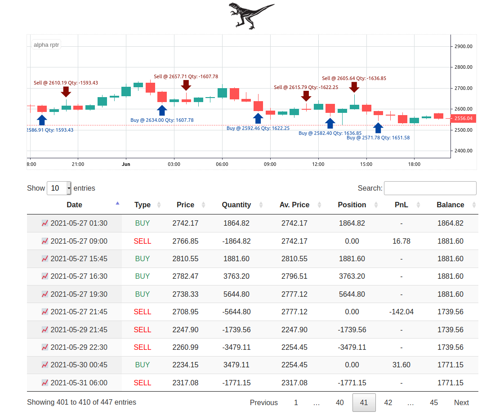

# alpha rptr


Trading system for automated algorithmic trading on Binance Futures and BitMEX.  

Author is not responsible for any damage caused by this software. Be careful and test your strategy using very small sizes for some time to make sure it does what you expect it to do. 

## Features

- API and Websocket implementation for both Binance Futures and  BitMEX
- Supports all pairs
- Event-driven
- all types of orders supported including majority of parameters/combinations - if you miss any, you can request
- Supports custom strategies
- Backtesting
- Testnet only for BitMEX (todo Binance Futures testnet)
- Stub trading 
- TA-lib indicators, you can request an indicator as well if its missing
- Very easy strategy implementation, should be easy enough to migrate most pine script(tradingview) strategies - see Sample strategy

## Implemented reference strategies

1. Channel Breakout
2. Cross SMA
3. RCI
4. Open Close Cross Strategy
5. Trading View Strategy (implemented but not supported in the current implementation via gmail) - maybe in the future todo tradingview webhooks implementation, until then this project is recommended for tradingview webhooks trading: https://github.com/CryptoMF/frostybot

## Requirements

- Python: 3.6.5

## How to install

### 1. Install packages

#### OSX

```bash
$ brew install ta-lib
$ git clone https://github.com/TheFourGreatErrors/alpha-rptr.git
$ cd alpha-rptr/
$ pip install -r requirements.txt
```

#### LINUX

```bash
$ wget http://prdownloads.sourceforge.net/ta-lib/ta-lib-0.4.0-src.tar.gz
$ tar xvzf ta-lib-0.4.0-src.tar.gz
$ cd ta-lib/
$ ./configure --prefix=/usr
$ make
$ sudo make install
$ git clone https://github.com/TheFourGreatErrors/alpha-rptr.git
$ cd alpha-rptr/
$ pip install -r requirements.txt
```

### 2. Setting keys 

Set your API keys in `src / config.py` file.

```python
config = {
    "binance_keys": {
                    "binanceaccount1":{"API_KEY": "", "SECRET_KEY": ""},
                    "binanceaccount2": {"API_KEY": "", "SECRET_KEY": ""}
                    },
    "bitmex_keys": {
                    "bitmexaccount1":{"API_KEY": "", "SECRET_KEY": ""},
                    "bitmexaccount2": {"API_KEY": "", "SECRET_KEY": ""}
                    },
    "bitmex_test_keys": {
                    "bitmextest1":{"API_KEY": "", "SECRET_KEY": ""},
                    "bitmextest2": {"API_KEY": "", "SECRET_KEY": ""}
                    },
    "line_apikey": {"API_KEY": ""}                       
}
```

If you want to send notifications to LINE, set LINE's API key as well. #todo discord and telegram notifications implementation as well.

## How to execute

```bash
$ python main.py --account binanceaccount1 --exchange binance --pair BTCUSDT --strategy Sample
 ```

By changing the values of `ACCOUNT` `EXCHANGE` `PAIR` `STRATEGY` you can switch accounts, exchanges, piars, strategies.

#### Case of using Channel Breakout on bitmex with bitmexaccount1 and XBTUSD pair

 ```bash
 $ python main.py --account bitmexaccount1 --exchange bitmex --pair XBTUSD --strategy Doten
 ```

## Mode
### 1. Production Trade Mode

```bash
$ python main.py --account binanceaccount1 --exchange binance --pair BTCUSDT --strategy Sample
```

### 2. Demo Trade Mode

It is possible to trade on BitMEX [testnet](https://testnet.bitmex.com/). (todo Binance Futures testnet)

```bash
$ python main.py --demo --account bitmexaccount1 --exchange bitmex --pair XBTUSD --strategy Sample
```

### 3. Back test Mode

```bash
$ python main.py --test --account binanceaccount1 --exchange binance --pair BTCUSDT --strategy Sample
```

### 4. Hyperopt Mode

```bash
$ python main.py --hyperopt --account binanceaccount1 --exchange binance --pair BTCUSDT --strategy Sample
```

### 5. Stub trade Mode

```bash
$ python main.py --stub --account binanceaccount1 --exchange binance --pair BTCUSDT --strategy Sample
```

## How to add a custom strategy

You can add a strategy by creating a new class in `src / strategy.py`.
Follow this example, which hopefully explains a lot of questions.

```python
# sample strategy

class Sample(Bot):
    # set variables
    long_entry_signal_history = []
    short_entry_signal_history = []

    def __init__(self): 
        # set time frame here       
        Bot.__init__(self, '1m')
        
    # this for parameter optimization in hyperopt mode - see other reference strategies  
    def options(self):
        return {}

    def strategy(self, open, close, high, low, volume):
        
        # get lot or set your own value which will be used to size orders 
        # careful default lot is about 20x your account size !!!
        lot = self.exchange.get_lot()

        # indicator lengths
        fast_len = self.input('fast_len', int, 6)
        slow_len = self.input('slow_len', int, 18)

        # setting indicators, they usually take source and length as arguments
        sma1 = sma(close, fast_len)
        sma2 = sma(close, slow_len)

        # entry conditions
        long_entry_condition = crossover(sma1, sma2)
        short_entry_condition = crossunder(sma1, sma2)

        # setting a simple stop loss and profit target in % using built-in simple profit take and stop loss implementation 
        # which is placing the sl and tp automatically after entering a position
        self.exchange.sltp(profit_long=1.25, profit_short=1.25, stop_long=1, stop_short=1.1, round_decimals=0)

        # example of calculation of stop loss price 0.8% round on 2 decimals hardcoded inside this class
        # sl_long = round(close[-1] - close[-1]*0.8/100, 2)
        # sl_short = round(close[-1] - close[-1]*0.8/100, 2)
        
        # order execution logic
        if long_entry_condition:
            # entry - True means long for every other order other than entry use self.exchange.order() function
            self.exchange.entry("Long", True, lot/20)
            # stop loss hardcoded inside this class
            #self.exchange.order("SLLong", False, lot/20, stop=sl_long, reduce_only=True, when=False)
            
        if short_entry_condition:
            # entry - False means short for every other order other than entry use self.exchange.order() function
            self.exchange.entry("Short", False, lot/20)
            # stop loss hardcoded inside this class
            # self.exchange.order("SLShort", True, lot/20, stop=sl_short, reduce_only=True, when=False)
        
        # storing history for entry signals, you can store any variable this way to keep historical values
        self.long_entry_signal_history.append(long_entry_condition)
        self.short_entry_signal_history.append(short_entry_condition)

        # OHLCV and indicator data, you can access history using list index        
        # log indicator values 
        logger.info(f"sma1: {sma1[-1]}")
        logger.info(f"second last sma2: {sma2[-2]}")
        # log last candle OHLCV values
        logger.info(f"open: {open[-1]}")
        logger.info(f"high: {high[-1]}")
        logger.info(f"low: {low[-1]}")
        logger.info(f"close: {close[-1]}")
        logger.info(f"volume: {volume[-1]}")
        #second last candle OHLCV values
        logger.info(f"second last open: {open[-2]}")
        logger.info(f"second last high: {high[-2]}")
        logger.info(f"second last low: {low[-2]}")
        logger.info(f"second last close: {close[-2]}")
        logger.info(f"second last volume: {volume[-2]}")
        # log history entry signals
        logger.info(f"long_entry_hist: {self.long_entry_signal_history}")
        logger.info(f"short_entry_hist: {self.short_entry_signal_history}")
```

## Basic HTML5 Charts and Order Info for Backtests



A basic HTML5 TradingView Lite (Open Source Version) widget based order visualization on top of Candle Stick data is available. It also displays a table with orders that can be sorted in many ways and clicking on any order date will auto-scroll that period into view.

A file called `orders.csv` file is generated after every backtest in the project root folder. And then at the end of each backtest `data.csv` from data folder and `orders.csv` from project root are symlinked into the new `html/data` diretory

We can then use this browser interface by executing `python3 -m http.server 8000` in the `html` folder and browse to https://127.0.0.1:8000/ to view backtest results.

Do not forget to refresh the page after each backtest for evaluating the results.

## Dedicated discord server
This server is dedicated for bug reporting, feature requests and support.
https://discord.gg/ah3MGeN

## Support

if you find this software useful and want to support the development, please feel free to donate.

BTC address: 
ETH address: 
